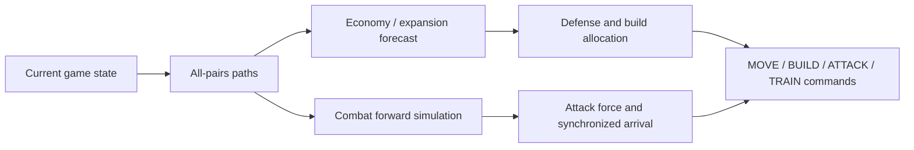

# NYPC 2026 Master Track Agent

[日本語](#日本語) | [English](#english)

## 日本語

### 結果

NYPC 2026 Master Trackに個人で参加し、**予選1,603チーム中19位（上位約1.2%）**でFinal Roundへ進出しました。

この競技では、2人のagentがgraph状の戦場で戦士を移動させ、拠点へbaseを建設・upgradeし、HQで兵力を訓練しながら相手HQの破壊を目指します。各turnで限られたgoldを移動、建設、訓練へ配分するため、最短経路だけでなく、将来の収入、維持費、増援、turret damage、残りturnを同時に判断する必要があります。

私はC++17によるheuristic agent、公式ルールを再現するPython judge、map generator、replay viewer、候補戦略のtournament環境を設計・実装しました。

### 戦略の構造



### 技術的に注力した点

#### 1. Floyd-Warshallによる全点対最短経路

戦場は51～109 regionのweighted graphです。初期化時にFloyd-Warshallで全region間の距離を計算し、各source-target pairのnext hopとhop数も保存します。その後の拠点候補、援軍、敵HQへの進軍、移動中の敵兵の目標推定は同じpath tableを使用します。

距離だけで建設を決めるのではなく、到着・建設までのturn、残りturnで得られるincome、建設・upgrade・移動・維持costを比較します。費用を制限時間内に回収できないbaseは候補から除外し、短期的な領土拡大が終盤のgold不足につながらないようにしました。

#### 2. `assaultOutcome`による攻撃・防御のforward simulation

「最も近い敵へ進む」規則では、中間拠点、両軍の増援、turret、訓練、gold変化を扱えません。そこで、敵HQやbaseへ到達するまでをturn単位で進める`assaultOutcome`を実装しました。

simulationは兵力の到着時点、building HP、turret/unit damage、双方のgold・income・upgrade・追加訓練を更新します。`plan_attack_force`は新規投入人数を増やしながら勝てる最小兵力を探索し、予測誤差に対して`ATTACK_SAFETY_MARGIN`を追加します。逆向きのsimulationでは、現在の敵進軍を防ぐために必要な守備兵力を計算します。

#### 3. 複数turnにまたがる部隊の目的と同期

戦士には`NONE`、`MOVE`、`BUILD`、`ATTACK`の目的を保持します。これにより、すでに建設や総攻撃へcommitした兵力を、次turnの別判断で誤って再配置しません。

異なる位置の兵力を同時に到着させるため、path長に合わせた`holdTurns`をsimulationへ反映します。攻撃対象が変わっても、集結地点と目的を追跡し、投入済みの兵力、追加訓練、移動costを重複計上しないようにしました。

#### 4. 公式ルールを再現したlocal judge

1つのmapや開始sideで勝っただけでは、戦略改善を判断できません。`judge.py`では、規則書に基づき次を実装しました。

- point symmetryを持つmapの生成
- 2段階のVoronoi centroid relaxation
- Delaunay/Voronoi ridgeに基づくgraph edge
- 建設、移動、訓練、戦闘、income、upkeepを最大200 turn実行
- seed、LEFT/RIGHT side、mapを変えた並列対戦
- CSV log、JSON replay、self-contained HTML viewer
- round-robin / Swiss tournament

`pool/`には19個のC++候補戦略を保存しています。同じseed条件でsideを入れ替えながら対戦させ、win countとscoreを比較し、特定のopponentやmapにだけ有効な変更を除外した後でfinal agentへ反映しました。

> `judge.py`は規則書を可能な限り再現したlocal simulatorであり、公式judge binaryではありません。post-relaxation centroidの整数化など、protocol上必要な差分はsource headerに明記しています。

### Repository layout

| Path | Role |
|---|---|
| `main.c++` | Final heuristic agent |
| `judge.py` | Local game engine, map generation, batch evaluation, tournament |
| `GameRules.md` | Cleaned game-rule reference |
| `pool/*.cpp` | 19 candidate strategies used for comparison |
| `replay_bot.cpp` | Replay/debug helper agent |
| `viewer_template.html` | Self-contained replay viewer template |
| `replay.csv`, `replay.html` | Example simulation output |

### 実行方法

Requirements:

- Python 3.11+
- `numpy`, `scipy`, `tqdm`
- `g++` with C++17 support

2つのsourceを100 gameで比較します。sourceは必要に応じて自動compileされます。

```bash
python judge.py main.c++ pool/110584.cpp --games 100 --workers 8 --seed 42
```

固定mapや相手commandを再現するdebug mode:

```bash
python judge.py main.c++ pool/110584.cpp --map-file <log-or-map-file>
python judge.py main.c++ --replay <match-log> --replay-side B
```

candidate poolをround-robinで比較する場合は、先にexecutableを用意します。

```bash
for f in pool/*.cpp; do g++ -O2 -std=c++17 -o "${f%.cpp}.exe" "$f"; done
python judge.py tournament pool --mode roundrobin --games 5 --workers 8 --seed 42
```

---

## English

### Result and problem

This is my solo entry for the NYPC 2026 Master Track. It ranked **19th among 1,603 teams in the qualifier (top ~1.2%)** and advanced to the Final Round.

Two agents move warriors across a graph battlefield, build and upgrade bases, train units at their headquarters, and try to destroy the opposing HQ. Every turn requires a joint decision over routes, gold, future income, upkeep, reinforcements, and combat.

I implemented the C++17 heuristic agent and a Python evaluation environment containing the game engine, map generator, replay viewer, batch runner, and candidate tournament.

### Engineering highlights

#### Graph planning and economy

Floyd-Warshall precomputes all-pairs weighted distance, next hop, and hop count for the 51–109 region graph. Expansion decisions compare travel/build time and remaining-turn income against movement, construction, upgrade, and upkeep cost; bases that cannot repay their cost before the 200-turn limit are excluded.

#### Turn-by-turn combat simulation

`assaultOutcome` simulates arrivals, building and turret damage, unit combat, gold, income, upgrades, and additional training. `plan_attack_force` searches for the minimum winning force and adds a safety margin. The inverse defensive simulation estimates how many units a threatened base must retain.

#### Persistent intent across turns

Each warrior retains one of `NONE`, `MOVE`, `BUILD`, or `ATTACK`. Already committed units are therefore not accidentally reassigned by the next turn's heuristic. `holdTurns` synchronizes forces coming from paths of different lengths, while committed units and future training are accounted for only once.

#### Reproducible local evaluation

The local judge reproduces the written rules, including symmetric map generation, two Voronoi centroid-relaxation passes, Delaunay/ridge adjacency, and up to 200 turns of build/move/train/combat/economy. It varies map seeds and starting sides, emits CSV/JSON/HTML replays, and supports parallel head-to-head, round-robin, and Swiss evaluation.

Nineteen candidate agents in `pool/` were compared under repeated conditions before changes were integrated into `main.c++`.

### Quick start

```bash
# compare two sources; they are compiled automatically when needed
python judge.py main.c++ pool/110584.cpp --games 100 --workers 8 --seed 42
```

See the Japanese section above for debugging, tournament commands, repository layout, and the simulator caveat.
